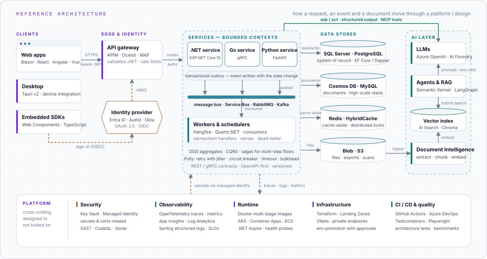
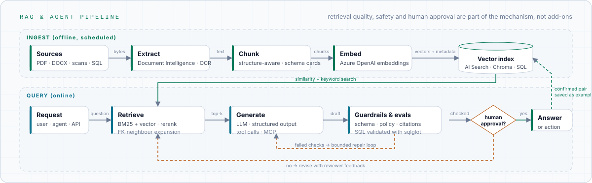

<picture>
  <source media="(prefers-color-scheme: dark)" srcset="assets/header-dark.svg">
  
</picture>

## Who I am

I'm a **Software Architect and hands-on Principal Engineer with 15+ years of experience** designing, building, securing and operating enterprise platforms for public-sector agencies, legal and compliance organisations, payments, telecom and higher education.

I work across the entire engineering lifecycle — **Domain → Architecture → APIs → Data → Cloud → Security → CI/CD → Production** — and I don't treat architecture as diagrams disconnected from implementation. I work from business boundaries through technical design, production code, infrastructure, delivery pipelines and operational concerns.

The last few years have added a second specialisation: **applied AI inside enterprise systems** — RAG, document intelligence, tool-using agents, text-to-SQL and MCP — engineered with the same requirements for reliability, security, observability, cost and maintainability as conventional software.

> **Enterprise architecture + hands-on engineering + security + production AI** — that combination is what I bring to a team.

## At a glance

| Area | Focus |
|---|---|
| **Role** | Software Architect · Technical Lead · hands-on Principal Engineer |
| **Experience** | 15+ years across enterprise and regulated environments (public sector, legal, payments, compliance) |
| **Primary platform** | C# / .NET 10 · ASP.NET Core · Blazor · EF Core · SQL Server · Azure |
| **Additional engineering** | Go (gRPC services) · Python (FastAPI, LangGraph) · TypeScript (React, Angular, Vue) |
| **Cloud** | Azure end to end (landing zones → workloads → observability) · AWS (ECS, RDS, S3, ElastiCache) |
| **Architecture** | DDD · modular monoliths · microservices · CQRS · event-driven systems |
| **Reliability** | Outbox/inbox · sagas · idempotency · retries · circuit breakers · back-pressure |
| **Security** | Entra ID · OAuth 2.0 · OIDC · Managed Identity · Key Vault · zero trust |
| **AI** | RAG · document intelligence · agents · text-to-SQL · MCP · evaluation |
| **Delivery** | GitHub Actions · Azure DevOps · Terraform · Docker · AKS |
| **Observability** | OpenTelemetry · Application Insights · Log Analytics / KQL |

## Why teams bring me in

- **Architecture ownership** — translate complex business requirements into bounded contexts, service boundaries, data ownership and integration contracts.
- **Hands-on execution** — move from architecture decisions to APIs, services, data models, infrastructure and production integrations.
- **Distributed systems** — design for failure using messaging, idempotency, retries, timeouts, compensation, resilience and operational recovery.
- **Cloud platform engineering** — design Azure platforms end to end, with AWS experience where client environments require it.
- **Security by design** — identity, authorisation, least privilege, secrets, zero-trust boundaries and secure delivery are part of the architecture, not a final checklist.
- **Production AI** — build RAG and agentic workflows with retrieval quality, evaluation, guardrails, human approval, observability and cost/latency as requirements.
- **Engineering enablement** — establish reusable patterns, architecture tests, CI/CD quality gates, testing strategies and delivery practices that let several teams move consistently.

## How I structure a platform

> **The simplest architecture that satisfies the requirement wins.** A modular monolith is the default until a boundary earns its own deployment. Microservices, asynchronous messaging and distributed workflows are introduced when they solve a measurable organisational, scalability, reliability or deployment problem.

<picture>
  <source media="(prefers-color-scheme: dark)" srcset="assets/architecture-dark.svg">
  
</picture>

Every layer is independently deployable and scalable, secured by identity rather than network position, and instrumented with OpenTelemetry from day one.

## Architecture & distributed systems

| Design | Distribution | Resilience |
|---|---|---|
| Domain-Driven Design — bounded contexts, aggregates, ubiquitous language | Microservices and modular monoliths, chosen per boundary | Retries with exponential backoff and jitter |
| Clean / vertical-slice architecture with explicit dependency direction | Event-driven architecture; CQRS where read/write separation earns it | Circuit breakers, bulkheads, timeouts (Polly v8 pipelines) |
| API design — REST, gRPC, versioning, OpenAPI-first contracts | Sagas and process managers for long-running workflows | Idempotent handlers and deduplication |
| Multi-tenant data isolation and per-tenant configuration | Outbox / inbox for reliable publishing and exactly-once effects | Dead-letter handling and replay strategies |
| Rules and workflow engines for configurable business logic | Eventual consistency with explicit compensation | Rate limiting, back-pressure, graceful degradation |
| Architecture decision records; architecture tests that keep the dependency graph honest | Distributed caching (cache-aside, HybridCache) and horizontal scaling | Health checks, readiness probes, failure isolation |

## Production AI engineering

I build AI features as **systems**, not demos — retrieval quality, cost, latency, safety and observability are engineering requirements.

<picture>
  <source media="(prefers-color-scheme: dark)" srcset="assets/rag-dark.svg">
  
</picture>

| Area | What I build |
|---|---|
| **RAG** | Hybrid retrieval (BM25 + vector), structure- and schema-aware chunking, reranking, citation tracking, offline evaluation sets; retrieval on Azure AI Search, Chroma and SQL Server vector stores |
| **Document intelligence** | Azure AI Document Intelligence and Text Analytics pipelines over legal, claims and scanned document corpora; structured extraction feeding search and downstream workflow automation |
| **Agentic systems** | LangGraph state machines and Semantic Kernel planners with typed tools, bounded retry/repair loops, persistent memory, human-approval gates, guardrails and evaluation |
| **Text-to-SQL** | Read-only database agents with schema-aware generation, SQL validated (`sqlglot`) before execution, and feedback loops from confirmed question → SQL pairs |
| **MCP** | Internal systems and desktop applications exposed through scoped, auditable tools with explicit permissions and identity boundaries — least privilege, not unrestricted access |
| **AI-assisted engineering** | Claude Code and Codex integrated into the lifecycle (design → implementation → review → migration → testing → documentation), governed by repository conventions, skills and automated verification — throughput up, judgment and quality gates intact |

## Security by design

| Identity | Application security | Secure delivery |
|---|---|---|
| Microsoft Entra ID · Auth0 · Okta | Zero-trust architecture; identity over network position | SAST and static analysis in the pipeline |
| OAuth 2.0 · OpenID Connect · JWT | Least-privilege access and explicit authorisation policies | CodeQL and Sonar analyzers as build gates |
| Managed Identity · workload identity federation | Secrets and certificates in Key Vault, rotated | Dependency and package governance |
| ASP.NET Core Identity · multi-tenant isolation | Input validation and sanitisation; secure API boundaries | Architecture tests that fail the build on violations |
| Token validation at the edge (JWKS, scopes) | Threat-aware architecture decisions and reviews | Secrets never in source control |

## Azure, end to end

| Area | Services |
|---|---|
| Foundation | Landing Zones, Management Groups, Subscriptions, Policy, RBAC |
| Networking | VNets, Private Endpoints, Private DNS, NSGs, Application Gateway / WAF, Front Door |
| Compute | App Service, Azure Functions, Container Apps, AKS, Container Registry |
| Data | Azure SQL, Cosmos DB, Blob Storage, Azure Cache for Redis |
| Integration | API Management, Service Bus, Event Grid, Logic Apps |
| AI | Azure OpenAI, AI Foundry, AI Search, AI Document Intelligence, AI Language |
| Identity & secrets | Microsoft Entra ID, Managed Identity, Key Vault, workload identity federation |
| Observability | Application Insights, Log Analytics / KQL, OpenTelemetry exporters, alerts and dashboards |
| Delivery | Azure DevOps Pipelines, GitHub Actions, Terraform, environment promotion with approvals |

**AWS**, where clients run there: ECS on Fargate, ALB, RDS PostgreSQL, ElastiCache Redis, S3, CloudWatch and WAF — provisioned with Terraform modules.

## Engineering quality & delivery

Architecture is incomplete until the system can be tested, deployed and operated safely.

| Quality gates | Testing strategy | Delivery | Operations |
|---|---|---|---|
| `TreatWarningsAsErrors` · `EnforceCodeStyleInBuild` | Unit — xUnit v3, NSubstitute / Moq, AutoFixture / Bogus | Trunk-based feature flow, production release tags | Structured logging (Serilog) and distributed tracing |
| Central package management | Property-based and snapshot testing | Hotfix-from-tag with merge-back; squash merges | Health checks and readiness probes |
| Sonar analyzers · CodeQL | Integration on Testcontainers | Multi-team release trains and coordination | SLO-oriented alerting and dashboards |
| Architecture tests as build gates | Playwright end-to-end with axe accessibility checks | Environment promotion with approvals | Production diagnostics and incident follow-through |
| Dependency and package governance | BenchmarkDotNet for hot paths; performance and load testing | Infrastructure as code with Terraform | Performance engineering and capacity planning |

## Technology stack

Curated on purpose — the architecture and engineering outcomes matter more than the number of tools. Everything below is in regular production use.

**Languages**

**Backend & APIs**

**Frontend & desktop**

**Data & caching**

**Messaging & background processing**

**AI & agents**

**Cloud, infrastructure & delivery**

**Observability**

**Testing & quality**

**Security & identity**

Also in regular use: Azure AI Text Analytics · Azure Functions · Azure API Management · Stripe, Twilio and SendGrid integrations · QuestPDF, ClosedXML and Open XML document generation · TWAIN / WIA / eSCL device integration · CodeMirror-based editors.

## Principles

<table>
  <tr>
    <td width="25%" valign="top"><strong>Domain first</strong> Model the business problem and its language before choosing frameworks. Technology is selected last, and only for the boundaries that need it.</td>
    <td width="25%" valign="top"><strong>Boundaries are explicit</strong> Contexts, contracts and data ownership are written down, versioned and enforced by architecture tests — not tribal knowledge.</td>
    <td width="25%" valign="top"><strong>Design for failure</strong> Every dependency will time out, throttle or disappear. Retries, idempotency, circuit breakers and fallbacks are designed in, not patched in.</td>
    <td width="25%" valign="top"><strong>Security is architecture</strong> Identity, least privilege and secrets handling are part of the design and the threat model, not middleware added before go-live.</td>
  </tr>
  <tr>
    <td valign="top"><strong>Observability is a feature</strong> If a production system cannot explain what it is doing through traces, metrics and structured logs, it is not finished.</td>
    <td valign="top"><strong>Async where it earns its complexity</strong> Messaging decouples failure and deployment domains; synchronous calls stay where latency and consistency genuinely require them.</td>
    <td valign="top"><strong>AI augments judgment</strong> Models draft, retrieve and verify; engineers own the decision — with evaluation, guardrails and human approval where the risk warrants it.</td>
    <td valign="top"><strong>Simplicity earns complexity</strong> A modular monolith beats premature microservices. Complexity is introduced when a measured requirement justifies it, never in anticipation.</td>
  </tr>
</table>

## What I'm looking for

Roles that combine **software architecture, principal-level engineering, cloud platform architecture, distributed systems, application security and AI / agentic engineering** — in environments that value both technical depth and engineering judgment: architecture that survives contact with production.

---

**Architect for scale. Build for security. Engineer for change.**

